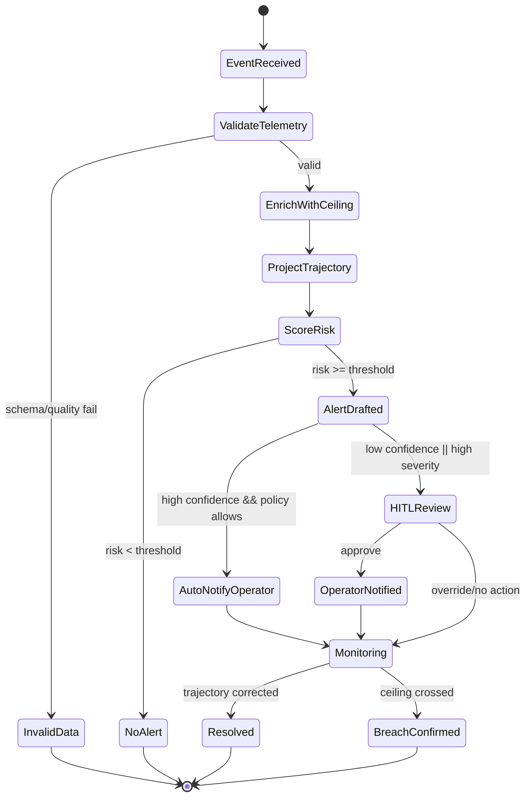

# Phase A Design README: Feature 1 (Altitude Early Warning)

## Notes (Regulatory Cadence for Simulation Design)
- FAA Remote ID cadence reference for Phase A simulation:
  - Compliant standard remote ID UAS must broadcast required message elements at **at least 1 message/second** and broadcast key position/altitude fields **no later than 1.0 second from time of measurement**.
  - Compliant remote ID broadcast modules have the same timing requirements (>=1 message/second and <=1.0 second measurement-to-broadcast for key position/altitude fields).
- References:
  - 14 CFR 89.310: https://www.law.cornell.edu/cfr/text/14/89.310
  - 14 CFR 89.320: https://www.law.cornell.edu/cfr/text/14/89.320
  - eCFR canonical pages: https://www.ecfr.gov/current/title-14/chapter-I/subchapter-F/part-89/section-89.310 and https://www.ecfr.gov/current/title-14/chapter-I/subchapter-F/part-89/section-89.320

## 0) Goal of Phase A
Deliver one FAA-relevant feature end-to-end in 2 days:
- Detect likely altitude ceiling breach before it happens
- Alert drone operator in real time
- Show autonomous decision flow with HITL option
- Expose API calls, tool chaining, and observability in dashboard

This is the right tradeoff for the timeline and still a strong reference.

## 1) Recommendation Agent vs Orchestrator Agent
Short answer: they are not the same role, but for Phase A they can be combined.

## Distinction
- `Orchestrator Agent` (control-plane): decides workflow path, retries, escalation, and state transitions.
- `Recommendation Agent` (decision-plane): generates action recommendations and rationale text.

## Phase A decision
- Merge recommendation behavior into orchestrator to reduce moving parts.
- Keep a clean interface so Recommendation Agent can be split out in Sprint 2.

Why this is good now:
- Less implementation risk in 2 days
- Same reference value for Feature 1
- Keeps architecture extensible

## 2) Phase A Scope (In/Out)
| In Scope | Out of Scope (Later Sprints) |
|---|---|
| Altitude early warning only | Geofence predictive breach |
| One autonomous orchestrator | Dedicated recommendation agent service |
| Ceiling lookup tool + risk tool | Weather-amplified scoring |
| HITL approve/override for high risk | Multi-scenario policy optimization |
| Dashboard for alerts + traces + KPIs | Full multi-tenant operations UI |

## 3) High-Level Architecture (Feature 1)
- `Telemetry Simulator` emits drone telemetry events.
- `Orchestrator Agent` receives event, calls tools, computes risk, decides action.
- `Tools` used by orchestrator:
  - `Ceiling Tool`: returns ceiling for location/zone.
  - `Trajectory Tool`: projects altitude at +N seconds.
  - `Risk Tool`: computes breach probability/confidence.
- `NoSQL Store`: drone state, alert lifecycle, event log.
- `Dashboard`: operator alert panel + technical observability panel.
- `Observability Pipeline`: traces, latency, token/tool counts, decision outcomes.

## 4) State Diagram (Feature 1)


## 5) Agent Memory Design (What and Why)
For this feature, memory should be minimal and explicit.

## Memory types needed now
1. `Working memory` (required)
- Last telemetry points per drone (for rate/projection)
- Current zone ceiling
- Latest risk score and confidence
- Time window: 30-120 seconds

2. `Operational memory` (required)
- Alert lifecycle states and timestamps
- HITL decisions (approve/override)
- Retry/fallback metadata

3. `Semantic memory` (not required in Phase A)
- SOP/doc retrieval via vector store can wait for Sprint 2.

## Recommendation
- Phase A: NoSQL only is acceptable and faster.
- Sprint 2: add vector memory for rationale grounding and historical similarity.

## 6) API and Tool Chaining (What to reference)
## API endpoints
- `POST /sim/start` start telemetry simulation
- `POST /sim/inject/altitude-breach` inject controlled scenario
- `GET /alerts/active` current alerts
- `POST /hitl/{alert_id}/decision` approve or override
- `GET /traces/{event_id}` execution chain for one event
- `GET /metrics/summary` latency/cost/quality summary

## Tool chain for one event
1. `Ceiling Tool` -> fetch zone max altitude
2. `Trajectory Tool` -> project altitude at t+6..10s
3. `Risk Tool` -> compute breach likelihood/confidence
4. `Policy Tool` -> decide auto-notify vs HITL gate

## 7) Observability (Must-Have for Phase A)
- End-to-end latency (event -> alert)
- Tool call durations and failures
- Alert precision proxy vs scenario labels
- HITL acceptance vs override rate
- Decision trace completeness (percent with full chain)

Dashboard tabs:
- `Operator`: live alerts and actions
- `Tech`: traces, state transitions, API/tool call logs
- `Metrics`: latency, quality, reliability

## 8) MCP Architecture and A2A Adaptation (Pragmatic)
## MCP in Phase A
Use MCP-style adapters conceptually for tool access:
- `ceiling-mcp-server` (simulated ceiling source)
- `telemetry-mcp-server` (simulated stream access)

Why it helps now:
- Clear separation between agent reasoning and data/tool providers
- Easier to replace simulated providers with real systems later

## A2A adaptation in Phase A
Use a lightweight internal agent message envelope (JSON) to mimic A2A patterns:
```json
{
  "event_id": "evt_123",
  "from_agent": "orchestrator",
  "to_component": "risk_tool",
  "intent": "score_altitude_breach",
  "payload": {"drone_id":"D-9","altitude":280,"vz":3.5,"ceiling":300},
  "trace_id": "trc_abc",
  "timestamp": "2026-02-13T20:00:00Z"
}
```
This gives protocol discipline without overbuilding.

## 9) Low-Level Design (Feature 1)
## Core domain objects
- `TelemetryEvent`
- `CeilingContext`
- `RiskAssessment`
- `Alert`
- `DecisionLogEntry`

## Core formulas (simple and explainable)
- `predicted_altitude = current_altitude + vertical_speed * horizon_seconds`
- breach condition: `predicted_altitude > ceiling`
- risk score: weighted blend of margin-to-ceiling and climb-rate trend

## Policy examples
- If risk >= 0.8 and confidence >= 0.75 -> auto-notify operator + log
- If risk >= 0.8 and confidence < 0.75 -> HITL review
- If risk < 0.8 -> monitor only

## 10) Decision Log (Phase A ADRs)
| ADR ID | Decision | Why Now | Revisit Trigger |
|---|---|---|---|
| ADR-001 | Focus Phase A on altitude early warning only | Maximize end-to-end reference reliability in 2 days | Stable baseline achieved, add next feature |
| ADR-002 | Merge Recommendation into Orchestrator | Reduce complexity and integration risk | Add multi-feature routing and richer narratives |
| ADR-003 | Use NoSQL only in Phase A | Fastest path for event/state queries | Need SOP retrieval or semantic similarity |
| ADR-004 | Rule-first risk scoring with optional ML stub | Explainable and deterministic for FAA reference | Need higher recall/precision under noisy data |
| ADR-005 | Streamlit dashboard over custom frontend | Fastest delivery with acceptable technical clarity | Stakeholder requests production-grade UX |
| ADR-006 | MCP-style tool adapters, lightweight A2A envelope | Teaches good architecture without protocol overhead | Integrating external agent ecosystems |

## 11) Tradeoff Checklist (Use During Build)
For each design choice, record these:
- Problem being solved
- Options considered
- Chosen option
- Why chosen for Phase A
- What risk is accepted
- What metric will tell us if decision is wrong
- Revisit date/sprint

## Example checklist entry
- Problem: agent role separation
- Options: (a) orchestrator+recommendation separate, (b) merged
- Chosen: merged
- Why now: 2-day scope control
- Accepted risk: less modularity
- Falsification metric: repeated branching logic complexity > agreed threshold
- Revisit: Sprint 2 planning

## 12) Suggested Iterative Working Style (Learning-Focused)
1. Confirm architecture and state diagram.
2. Freeze ADR-001..006 before coding.
3. Implement one happy path end-to-end.
4. Add one failure path (tool timeout / low confidence).
5. Instrument observability before UI polish.
6. Run reference rehearsal and update decision log.

This keeps learning, system design, and delivery aligned.
