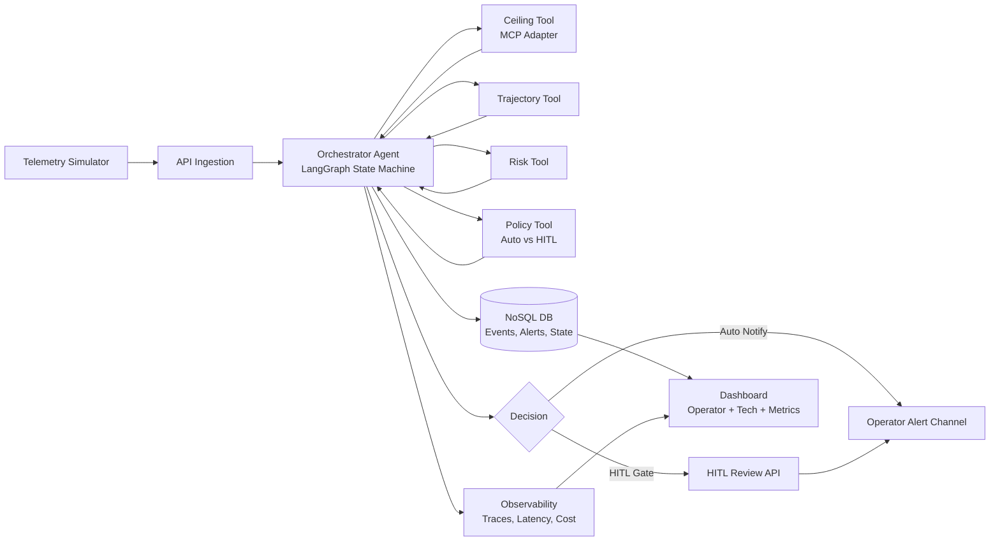
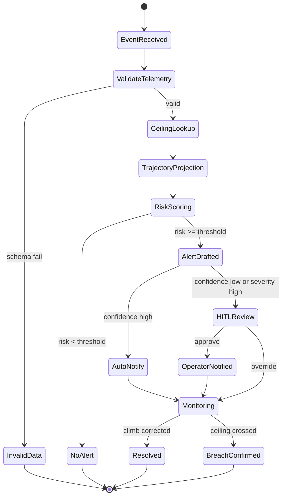

# Phase A Execution Plan: Feature 1 (Altitude Early Warning)

## 1) Sprint Goal
Deliver one end-to-end reference in 2 days for FAA technical stakeholders:
- Predict likely altitude ceiling breach before violation
- Notify operator in real time
- Show autonomous orchestration + HITL decisioning
- Show API/tool chain and observability metrics on dashboard

## 2) Scope for Phase A
| In Scope | Deferred to Sprint 2+ |
|---|---|
| Altitude early warning only | Geofence prediction |
| Orchestrator with embedded recommendation logic | Separate recommendation agent |
| NoSQL-backed operational memory | Vector semantic memory |
| Simulated telemetry + ceiling metadata | Live FAA/LAANC/Remote ID integrations |
| Streamlit operator + tech dashboard | Production-grade frontend |

## 3) Architecture Decisions (Phase A)
- Use `LangGraph` for stateful orchestration and branching.
- Use `LangChain` for tool/model abstraction and consistent tool-calling interface.
- Merge Recommendation into Orchestrator for timeline control.
- Use NoSQL only in Phase A (event/state lifecycle). Add vector store later if needed for semantic rationale.

## 4) Overall Architecture Diagram (Feature 1)

## 5) Feature 1 Execution State Diagram

## 6) Component Responsibilities
| Component | Responsibility | Output |
|---|---|---|
| Simulator | Emits telemetry and injected altitude breach scenarios | Event stream |
| Orchestrator | Runs workflow state machine, tool chaining, branching, retries | Alert decision + trace |
| Ceiling Tool | Returns max allowed altitude for zone | Ceiling context |
| Trajectory Tool | Predicts altitude for next 6-10 seconds | Projection features |
| Risk Tool | Computes breach likelihood + confidence | Risk assessment |
| Policy Tool | Decides auto-notify vs HITL gate | Decision route |
| NoSQL DB | Stores telemetry, alert lifecycle, state transitions | Queryable history |
| Dashboard | Shows alerts, traces, and KPIs | Stakeholder reference UI |

## 7) API Surface for reference
- `POST /sim/start`
- `POST /sim/inject/altitude-breach`
- `GET /alerts/active`
- `POST /hitl/{alert_id}/decision`
- `GET /traces/{event_id}`
- `GET /metrics/summary`

## 8) Memory Model (Phase A)
Use only operational/working memory in NoSQL.

- Working memory:
  - Recent telemetry window per drone
  - Current ceiling and projected altitude
  - Current risk/confidence
- Operational memory:
  - Alert state transitions
  - HITL decisions and timestamps
  - Retry/fallback history

Reason: this is sufficient for Feature 1; semantic memory can be added in Sprint 2.

## 9) MCP and A2A Adaptation (Lightweight)
- MCP-style adapters:
  - `ceiling-mcp-adapter` for zone ceiling lookup
  - `telemetry-mcp-adapter` for simulator feed access
- A2A-style message envelope for internal calls:
  - `event_id`, `from`, `to`, `intent`, `payload`, `trace_id`, `timestamp`

This provides protocol discipline without adding heavy integration overhead.

## 10) 2-Day Build Plan
## Day 1 (Core pipeline)
1. Repo bootstrap, env config, local DB, base API server.
2. Telemetry simulator + deterministic altitude-breach injection.
3. LangGraph orchestrator skeleton with states and transitions.
4. Ceiling/trajectory/risk tools wired and testable.
5. NoSQL schemas for events, alerts, and state history.

Day 1 exit criteria:
- One altitude-breach scenario produces a persisted alert with full trace.

## Day 2 (HITL + dashboard + observability)
1. Add policy routing: auto-notify vs HITL gate.
2. Add HITL API and alert lifecycle updates.
3. Build dashboard tabs (operator alerts, technical traces, metrics).
4. Add KPI calculations (latency, reliability, quality proxy).
5. Run scripted reference + failure-path rehearsal.

Day 2 exit criteria:
- Stable 5-10 minute reference with operator alert, HITL action, and trace/KPI visibility.

## 11) Phase A KPIs
- End-to-end detection latency (p50/p95)
- Tool-call success/failure rate
- Alert precision proxy (against simulated ground truth)
- HITL approve/override rate
- Trace completeness (% alerts with full tool chain logged)

## 12) Initial Decision Log (to maintain during sprint)
| ID | Decision | Reason | Revisit |
|---|---|---|---|
| S1-ADR-001 | Feature 1 only | Max reliability in 2 days | Sprint 2 planning |
| S1-ADR-002 | Merge recommendation into orchestrator | Lower implementation risk | Multi-feature expansion |
| S1-ADR-003 | NoSQL-only memory | Enough for operational workflow | Need semantic retrieval |
| S1-ADR-004 | Rule-first risk scoring | Explainable and deterministic | Quality gap in eval |
| S1-ADR-005 | Streamlit dashboard | Fastest local delivery | UX hardening phase |

## 13) Design Tradeoff Checklist (fill per change)
- Problem being solved
- Options considered
- Chosen option
- Why chosen now
- Risk accepted
- Metric to validate/falsify decision
- Revisit sprint/date

## 14) Definition of Done (Phase A)
- Feature 1 runs end-to-end locally with deterministic scenario.
- Operator receives "likely ceiling breach in N seconds" alert with confidence.
- HITL approve/override path changes lifecycle state correctly.
- Dashboard shows alerts, traces, and KPIs.
- Decision log updated with key tradeoffs and revisit triggers.
